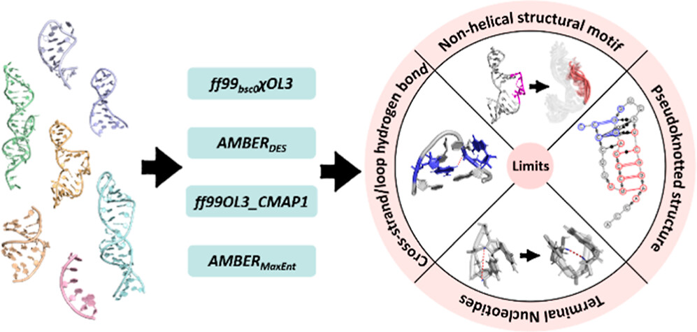

<i>If you want to master something, teach it.</i>                                            

      

-Richard P. Feynman     

       

 若欲精通某事，便需将其教给他人。    

      

——理查德·费曼       

# Research Interests

My General research interest is to explore the physics principles underlying life systems and apply them to improve health. To address this goal, I'm investigating and modeling the interaction in biomolecules by theoretical and compuational chemistry.

To describe and simulate such dynamic biomolecular interactions, empirical physics models known as force fields have been widely used for a long time. The successful simulation of many complex chemical systems using force fields was eventually awarded the Nobel Prize in Chemistry in 2013. On the other hand, despite being actively developed for several decades, empirical force fields for biomolecules still frequently fail to simulate the correct conformational ensembles in many cases, especially when the biomolecules have very flexible structures, such as intrinsically disordered proteins and most RNAs.

The lesson I learned from previous research is that biomolecular interaction involves quantum mechanics effects, which empirical force fields poorly describe. Therefore, I‘m about to utilize the brute force of AI to achieve robust and accurate simulations of biomolecules by correcting the interactions involving quantum effects.

For a long time, I have wanted to figure out the essence of life. If the aforementioned AI model successfully achieves precise simulations of all biomolecules, I believe I could find the answers I seek within them.

