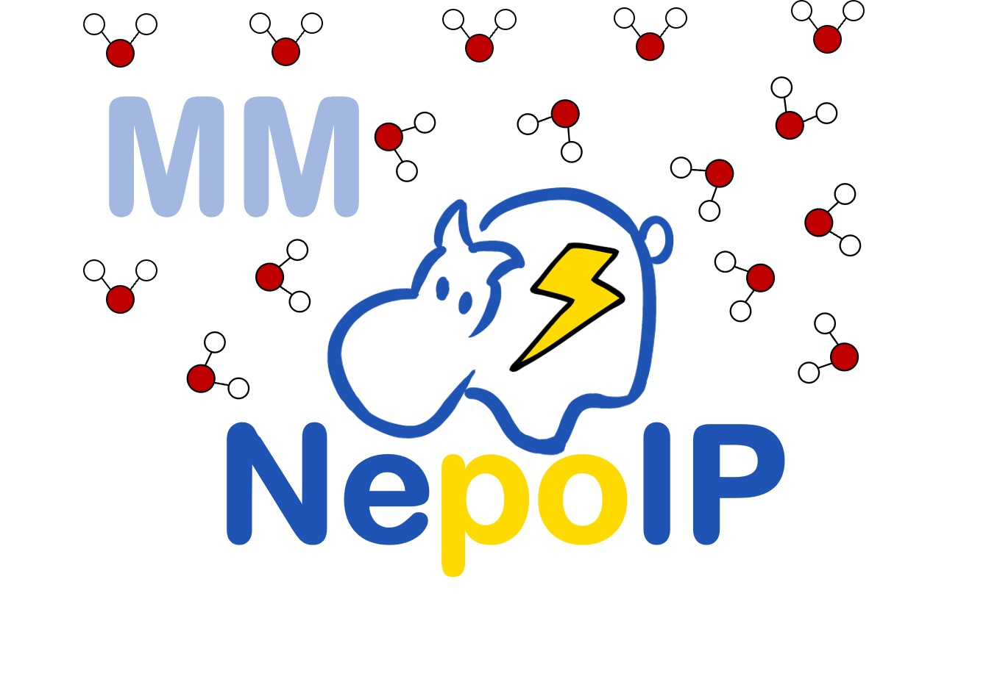

<i>If you want to master something, teach it.</i>                                            

      

-Richard P. Feynman     

       

 若欲精通某事，便需将其教给他人。    

      

——理查德·费曼       

---

# Research Interests

My General research interest is to explore the physics principles underlying life systems and apply them to improve health. To address this goal, I'm mainly investigating and modeling the interaction in biomolecules by developing force fields.

---

# Current Project

* **Development of Machine Learning Force Fields**

  

  > NepoIP/MM is an open-source code for performing accurate ML/MM MD simulation with electrostatic embedding.

---

# Previous Work

---

* **Automatic Sleep Stage Classification by Neural Networks**

  Preprint article: [[2407.04753\] Annotation of Sleep Depth Index with Scalable Deep Learning Yields Novel Digital Biomarkers for Sleep Health (arxiv.org)](https://export.arxiv.org/abs/2407.04753)

  Web server software (Old version of SleepViTNet) : [CalvinGe/Web-SleepViTNet (github.com)](https://github.com/CalvinGe/Web-SleepViTNet)

---

* **Development of Force Fields for Phospho-proteins**

  [GitHub - HFChenLab/FB18CMAP: FB18CMAP force field parameter](https://github.com/HFChenLab/FB18CMAP)

  

---

* **Development of Force Fields for RNAs**

  

---

* **Computer-aided Drug Design**

  

