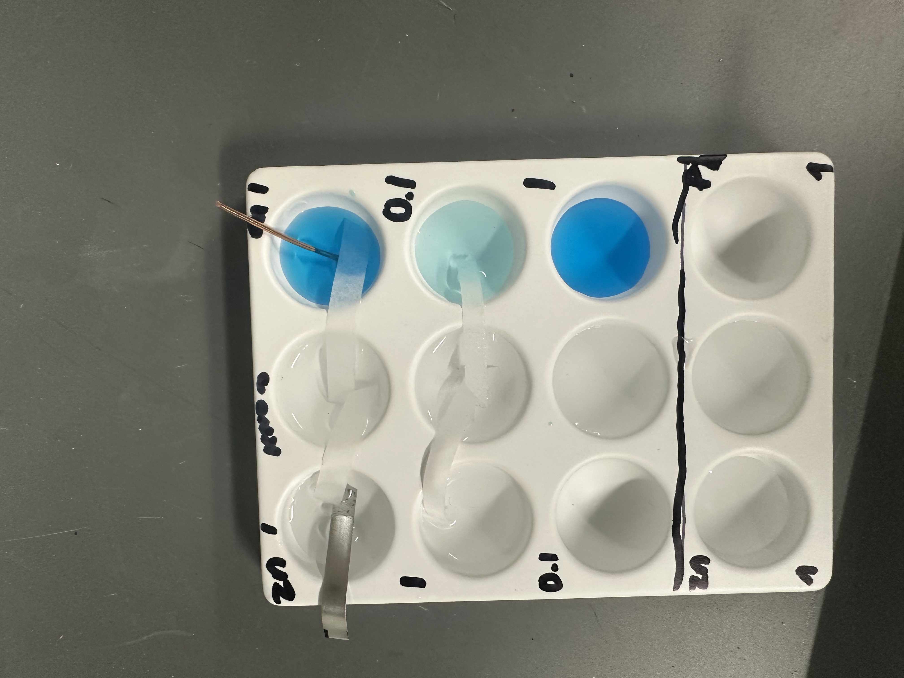

I have teached five labs of Chem 110 Honor Undergraduate course: 1. Quantum Mechanics; 2. Molecular Modeling with Spartan; 3. Integrated Rate Laws; 4. Freezing Point Depression; 5. Electrochemistry. Click the [link](https://calvinge.github.io/gesong.github.io/teaching/2023-fall-teaching-1) to see fun labs we did!

My jobs were mainly discussing the pre-lab materials, teaching 3 classes (each 8-10 ppl) in lab and grading for the reports.

 

Quantum Mechanics
======

Molecular Modeling with Spartan
======

Integrated Rate Laws
======

# Freezing Point Depression

# Electrochemistry

